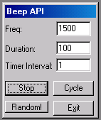

<div align="center">

## Beep


</div>

### Description

Uses the 'Beep' function of the API to produce sound.
 
### More Info
 
dwFreq, dwDuration (API).

A Standard EXE Project, with 1 form (any name)

Textboxes: txtFreq, txtDur, txtInterval

Command Buttons: cmdPlay,cmdCycle, cmdExit

Labels (Array): Label1 (0-2)

Checkboxes: Check1

Timer Controls: Timer1, Timer2

Sound from the internal speaker.


<span>             |<span>
---                |---
**Submitted On**   |
**By**             |[Kevin Bowker](https://github.com/Planet-Source-Code/PSCIndex/blob/master/ByAuthor/kevin-bowker.md)
**Level**          |Advanced
**User Rating**    |4.7 (14 globes from 3 users)
**Compatibility**  |VB 5\.0, VB 6\.0
**Category**       |[Windows API Call/ Explanation](https://github.com/Planet-Source-Code/PSCIndex/blob/master/ByCategory/windows-api-call-explanation__1-39.md)
**World**          |[Visual Basic](https://github.com/Planet-Source-Code/PSCIndex/blob/master/ByWorld/visual-basic.md)
**Archive File**   |[](https://github.com/Planet-Source-Code/kevin-bowker-beep__1-24675/archive/master.zip)

### API Declarations

```
Private Declare Function Beep Lib "kernel32" (ByVal dwFreq As Long, ByVal dwDuration As Long) As Long
```


### Source Code

```
Option Explicit
' An example of the Beep API call, which IMHO is possibly the most useless to most.
' Nonetheless, I wanted this functionality for a client who needed audible feedback
' on some very old equipment (no sound cards). After searching MSDN, I found
' no extended information on the parameters, dwFreq and dwDuration. What value
' range produces audible sounds? Although I still don't have that answer, I've found
' you can pretty much hear everything in the dwFreq range from 50 to 6000, 6000
'being the higher frequency. Setting dwDuration from 10 to 100 seems to give the
' length of a short 'beep' that isn't too annoying.
'
' Feel free to use, modify, or trash this code as you see fit.
Private rc as Long
Private PauseReq As Boolean
Private mvarFreq As Long
Private mvarDur As Long
Private cFreq As Long
Private Declare Function Beep Lib "kernel32" (ByVal dwFreq As Long, ByVal dwDuration As Long) As Long
Private Sub cmdPlay_Click()
 cmdPlay.Caption = IIf(cmdPlay.Caption = "Play", "Stop", "Play")
 If cmdPlay.Caption = "Play" Then
  PauseReq = True
  Timer1.Enabled = False
 Else
  PauseReq = False
  Timer1.Enabled = True
 End If
End Sub
Private Sub cmdExit_Click()
 PauseReq = True
 Unload Me
End Sub
Private Sub cmdCycle_Click()
 cmdCycle.Caption = IIf(cmdCycle.Caption = "Cycle", "Stop", "Cycle")
 If cmdCycle.Caption = "Stop" Then
  Timer1.Enabled = False
  cFreq = 50
 Else
  Timer1.Enabled = True
 End If
 Timer2.Enabled = Not Timer1.Enabled
End Sub
Private Sub Form_Load()
 PauseReq = False
 Timer1.Enabled = True
 Timer1.Interval = 1000
 Me.Move (Screen.Width - Me.Width) * 0.75, (Screen.Height - Me.Height) * 0.8
End Sub
Private Sub txtFreq_Change()
 If IsNumeric(txtFreq.Text) Then mvarFreq = CLng(txtFreq.Text)
End Sub
Private Sub txtDur_Change()
 If IsNumeric(txtDur.Text) Then mvarDur = CLng(txtDur.Text)
End Sub
Private Sub txtInterval_Change()
 If IsNumeric(txtInterval.Text) Then Timer1.Interval = (CLng(txtInterval.Text) * 1000)
End Sub
Private Sub Timer1_Timer()
 If PauseReq Then Exit Sub
 rc = Beep(mvarFreq, mvarDur)
End Sub
Private Sub Timer2_Timer()
 If Check1.Value = 0 Then
  txtFreq.Text = cFreq
  txtDur.Text = Timer2.Interval + 10
  rc = Beep(cFreq, Timer2.Interval + 10)
  cFreq = cFreq + 25
  If cFreq > 6000 Then cFreq = 50
 Else
  cFreq = Int(Rnd * 6000)
  txtFreq.Text = cFreq
  rc = Beep(cFreq, Timer2.Interval + 10)
 End If
End Sub
```

